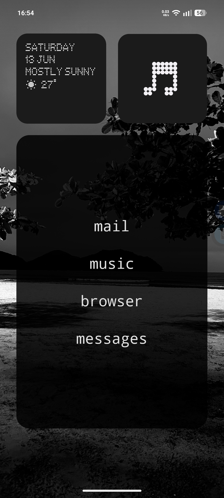
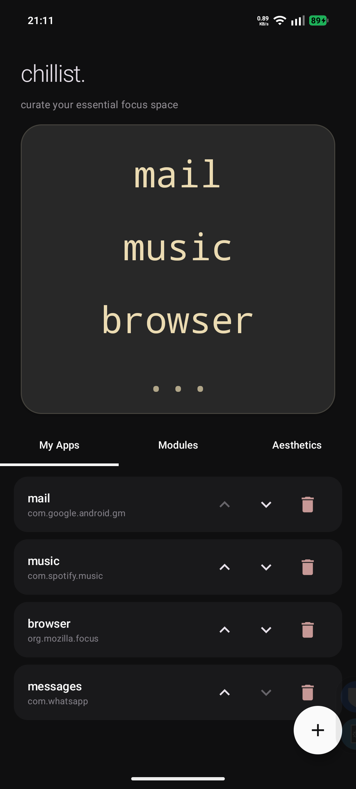
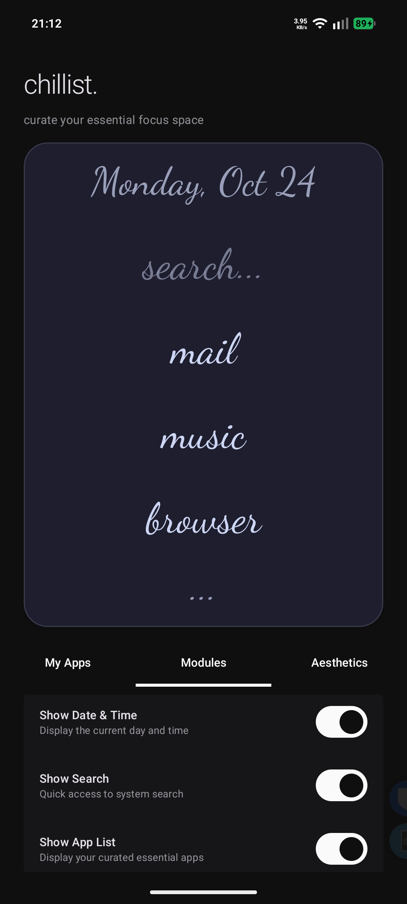

# chillist

Minimal text-based launcher widget for Android. Replaces app grids with a clean list.

  
  &nbsp;&nbsp;
  
  &nbsp;&nbsp;
  

## features

- text list to launch apps
- custom labels to rename them
- themes like catppuccin, gruvbox, nord, and tokyo night
- Nothing OS styled dot-matrix font support
- adjust fonts, sizes, and alignment
- optional date/time, search, and dividers
- app icon matching system themes

## build

1. clone the repo:
   `git clone https://codeberg.org/0xShred/chillist.git`
2. run `./gradlew clean installDebug`
3. add the widget to your home screen
